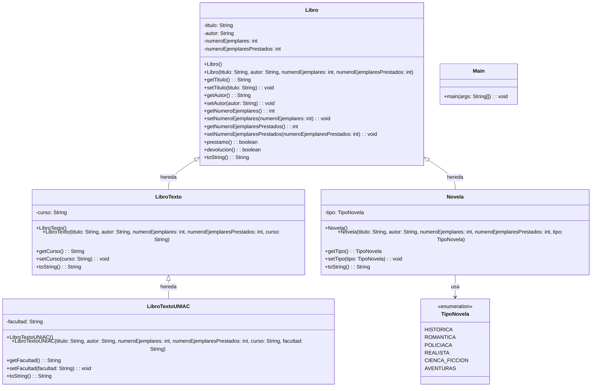

# Biblioteca
PARCIAL I

## Sistema de Gestión de Biblioteca

Este proyecto implementa un sistema de gestión de biblioteca en Java aplicando los principios de Programación Orientada a Objetos (POO): abstracción, encapsulamiento y herencia.

## Guía de Uso

### Requisitos Previos
- Java JDK 11 o superior
- Maven 3.6 o superior
- Git (opcional, para control de versiones)

### Instalación y Configuración
1. Clona o descarga el proyecto
2. Navega al directorio del proyecto: `cd Biblioteca`
3. Compila el proyecto: `mvn compile`

### Ejecución del Programa
Ejecuta el programa principal con Maven:
```bash
mvn exec:java
```

O compila y ejecuta manualmente:
```bash
mvn compile
java -cp target/classes biblioteca.Main
```

### Uso del Sistema

#### Crear Libros
```java
// Libro general
Libro libro = new Libro("El Quijote", "Miguel de Cervantes", 10, 2);

// Libro de texto
LibroTexto libroTexto = new LibroTexto("Matemáticas", "Autor X", 5, 0, "Matemáticas I");

// Libro de texto UNIAC
LibroTextoUNIAC libroUNIAC = new LibroTextoUNIAC("Física", "Autor Y", 3, 0, "Física I", "Facultad de Ciencias");

// Novela
Novela novela = new Novela("1984", "George Orwell", 8, 0, TipoNovela.CIENCA_FICCION);
```

#### Operaciones de Préstamo
```java
// Realizar préstamo
boolean exitoPrestamo = libro.prestamo();
if (exitoPrestamo) {
    System.out.println("Préstamo realizado exitosamente");
} else {
    System.out.println("No hay ejemplares disponibles");
}

// Realizar devolución
boolean exitoDevolucion = libro.devolucion();
if (exitoDevolucion) {
    System.out.println("Devolución realizada exitosamente");
} else {
    System.out.println("No hay ejemplares prestados para devolver");
}
```

#### Mostrar Información
```java
System.out.println(libro.toString());
```

### Tipos de Libros Disponibles
- **Libro**: Clase base con información general
- **LibroTexto**: Libros asociados a cursos específicos
- **LibroTextoUNIAC**: Libros publicados por facultades de la UNIAC
- **Novela**: Novelas clasificadas por género (histórica, romántica, policíaca, realista, ciencia ficción, aventuras)

### Validaciones Implementadas
- No se pueden prestar libros sin ejemplares disponibles
- No se pueden devolver libros que no han sido prestados
- Gestión automática del contador de ejemplares prestados

## Diagrama de Clases


